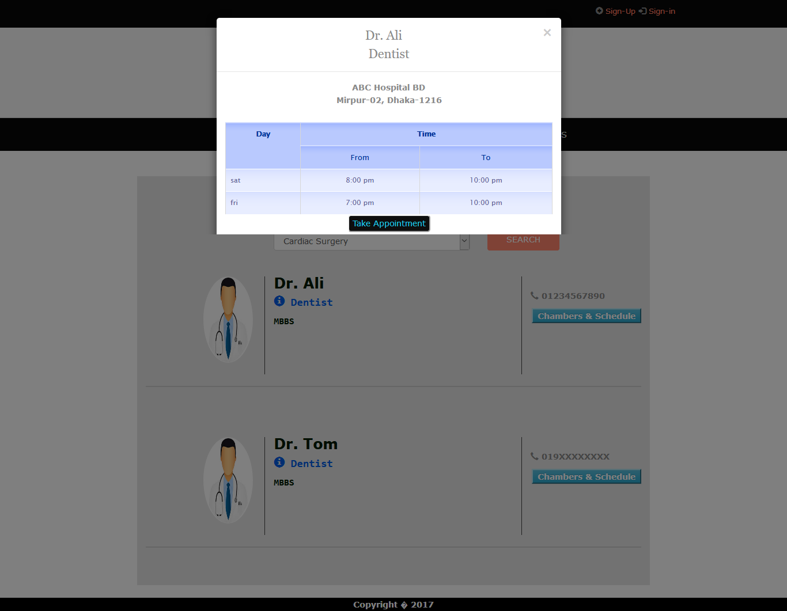

# ecare

This project was developed in the last semester.Here we tried to build a platform where people get both doctor's appointment service and blood donor.We tried something that would connect all the doctors'of different hospital in this platform. A patient can take appointment online and they can also search for donor.

Just clone the repo in the htdocs folder on xampp and import the sql file in MySQL then change the database user,password in the includes/db_connection.php file.

Back-end: raw PHP,MySQL
Front-end: Bootstrap,CSS,HTML,Javascript

Some Screenshots of the website

